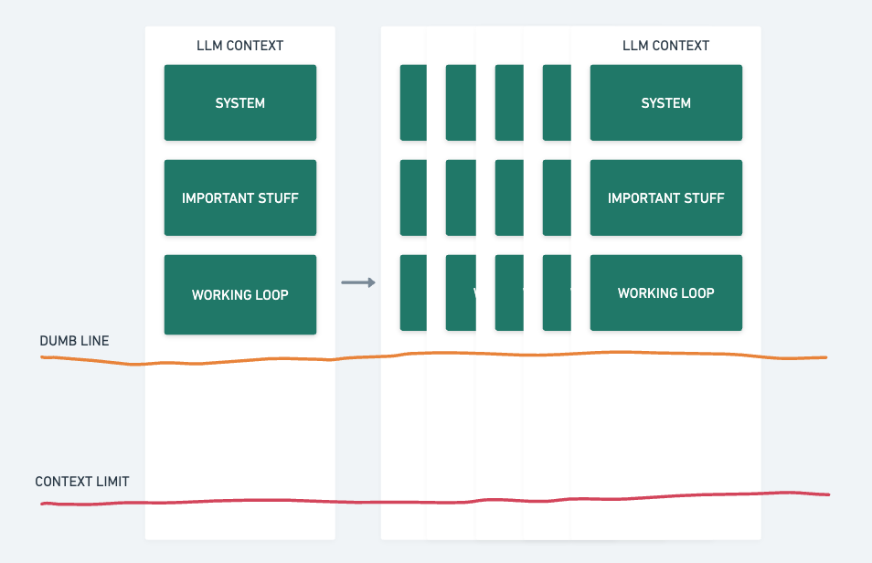

# Ralph



Autonomous build loop powered by Claude Code. Turns a conversation into specs, a plan, and working code.

## Workflow

```
Discuss JTBD → ralph-spec → ralph plan → ralph
```

1. **Discuss** — Start a Claude Code session and have it interview you about what you want to build. Flesh out the Job to be Done (JTBD) through conversation before generating any specs.
2. **Spec** — Run `/ralph-spec` in the same session. Ralph splits the JTBD into topics of concern and writes a spec file for each under `./specs/`.
3. **Plan** — Run `ralph --plan` from your terminal. Ralph studies the specs and codebase, then produces `IMPLEMENTATION_PLAN.json` — a task list with completion tracking.
4. **Build** — Run `ralph` from your terminal. Ralph picks up incomplete tasks from the plan, implements them, runs tests, commits, and loops until everything is done.

### Videos

- [Basic explanation of the technique](https://www.youtube.com/watch?v=I7azCAgoUHc)
- [First principles from creator](https://www.youtube.com/watch?v=4Nna09dG_c0)
- [Additional context](https://www.youtube.com/watch?v=SB6cO97tfiY)

## Concepts

| Term               | Definition                                                      |
| ------------------ | --------------------------------------------------------------- |
| Job to be Done     | High-level user need or outcome                                 |
| Topic of Concern   | A distinct aspect or component within a JTBD                    |
| Spec               | Requirements doc for one topic of concern (`specs/<name>.md`)   |
| Task               | Unit of work derived from comparing specs to code               |

- 1 JTBD &rarr; many topics of concern
- 1 topic of concern &rarr; 1 spec
- 1 spec &rarr; many tasks

**Scope test:** Can you describe a topic in one sentence without "and"? If not, split it.

## Prerequisites

- [Claude Code](https://docs.anthropic.com/en/docs/claude-code) CLI
- [jq](https://jqlang.github.io/jq/)

## Installation

```sh
git clone <repo-url> && cd ralph
./install.sh
```

This symlinks the skills into `~/.claude/skills/` and `ralph` into `~/.local/bin/`. Make sure `~/.local/bin` is in your `PATH`.

## Usage

```sh
# Step 1: Start a Claude Code session, discuss your JTBD, then:
/ralph-spec

# Step 2: Generate implementation plan from specs
ralph --plan              # plan mode, unlimited iterations
ralph --plan -n 5         # plan mode, max 5 iterations

# Step 3: Build loop — implement, test, commit, repeat
ralph                     # build mode, unlimited iterations
ralph -n 20               # build mode, max 20 iterations

# Options
ralph --help              # show usage
ralph --danger            # enable --dangerously-skip-permissions
ralph --plan -n 5 --danger
```

### AGENTS.md

Ralph respects [`AGENTS.md`](https://agents.md) — a plain-Markdown file at the root of your repo (or in subdirectories) that gives AI coding agents project-specific instructions: build commands, test invocations, code style rules, and other conventions.

If your repo has an `AGENTS.md`, Ralph will pick it up automatically during the plan and build phases. This is a good place to put information that Ralph needs but that would clutter your human-facing README — things like exact linting flags, preferred patterns, or areas of the codebase to avoid touching.

See [agents.md](https://agents.md) for the format and examples.

## Project Structure

```
ralph.sh              # Main loop runner
install.sh            # Installer (symlinks skills + CLI)
skills/
  ralph-spec/         # JTBD → spec files
  ralph-plan/         # Specs → implementation plan
  ralph-build/        # Plan → working code
```

## Acknowledgements

Ralph is based on the autonomous build loop technique [created by Geoffrey Huntley](https://ghuntley.com/ralph/). [The Ralph Playbook](https://github.com/ClaytonFarr/ralph-playbook) by Clayton Farr was a key inspiration for this implementation — it organizes the technique's principles, loop mechanics, and file conventions into a clear, actionable reference.
