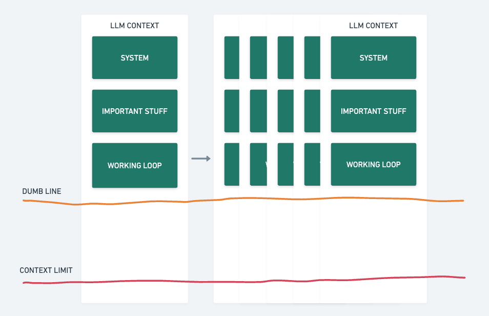

# Ralph



Autonomous build loop powered by Claude Code. Turns a conversation into specs, a plan, and working code.

## Workflow

```
Discuss JTBD → ralph-spec → ralph plan → ralph build
```

1. **Discuss** — Start a Claude Code session and have it interview you about what you want to build. Flesh out the Job to be Done (JTBD) through conversation before generating any specs.
2. **Spec** — Run `/ralph-spec` in the same session. Ralph splits the JTBD into topics of concern and writes a spec file for each under `./specs/`.
3. **Plan** — Run `ralph plan` from your terminal. Ralph studies the specs and codebase, then syncs a task backlog into the SQLite database via `ralph task plan-sync`.
4. **Build** — Run `ralph build` from your terminal. Ralph picks up incomplete tasks from the plan, implements them, runs tests, commits, and loops until everything is done.

### Videos

- [Basic explanation of the technique](https://www.youtube.com/watch?v=I7azCAgoUHc)
- [First principles from creator](https://www.youtube.com/watch?v=4Nna09dG_c0)
- [Additional context](https://www.youtube.com/watch?v=SB6cO97tfiY)

## Concepts

| Term               | Definition                                                      |
| ------------------ | --------------------------------------------------------------- |
| Job to be Done     | High-level user need or outcome                                 |
| Topic of Concern   | A distinct aspect or component within a JTBD                    |
| Spec               | Requirements doc for one topic of concern (`specs/<name>.md`)   |
| Task               | Unit of work derived from comparing specs to code               |

- 1 JTBD &rarr; many topics of concern
- 1 topic of concern &rarr; 1 spec
- 1 spec &rarr; many tasks

**Scope test:** Can you describe a topic in one sentence without "and"? If not, split it.

## Prerequisites

- [Claude Code](https://docs.anthropic.com/en/docs/claude-code) CLI
- [jq](https://jqlang.github.io/jq/)
- [sqlite3](https://www.sqlite.org/) ≥ 3.35 (for RETURNING clause support)
- [shellcheck](https://github.com/koalaman/shellcheck?tab=readme-ov-file#installing)

## Installation

```sh
git clone <repo-url> && cd ralph
./install.sh
```

This symlinks the skills into `~/.claude/skills/`, the `ralph` binary into `~/.local/bin/`, and installs Claude Code hooks (`PreCompact` and `SessionEnd`) into `~/.claude/settings.json`. Any legacy `~/.local/bin/task` symlink is removed — the task CLI is now accessed exclusively via `ralph task`. Make sure `~/.local/bin` is in your `PATH`.

## Usage

```sh
# Step 1: Start a Claude Code session, discuss your JTBD, then:
/ralph-spec

# Step 2: Generate implementation plan from specs
ralph plan                # plan mode (default: 1 iteration)
ralph plan -n 5           # plan mode, max 5 iterations

# Step 3: Build loop — implement, test, commit, repeat
ralph build               # build mode, unlimited iterations
ralph build -n 20         # build mode, max 20 iterations

# Step 4: Interact with the task backlog directly
ralph task list           # list non-deleted tasks
ralph task plan-status    # show status summary
ralph task peek           # preview claimable tasks

# Options
ralph --help              # show top-level usage
ralph plan --help         # show plan subcommand help
ralph build --help        # show build subcommand help
ralph build --danger      # enable --dangerously-skip-permissions
ralph plan -n 5 --danger

# Model selection
ralph plan -m opus-4.5    # use a model alias from models.json
ralph build --model sonnet # long form
ralph build --model claude-opus-4-5-20251101  # full model ID pass-through
```

### Model Selection

Use `--model` (or `-m`) to pick which Claude model to run. Ralph resolves short aliases via `models.json`, which maps each alias to the correct model ID for your backend (Anthropic API or Bedrock). The backend is detected automatically from `~/.claude/settings.json`.

| Alias | Bedrock Model ID |
| --- | --- |
| `opus-4.6` | `global.anthropic.claude-opus-4-6-v1` |
| `opus-4.5` | `global.anthropic.claude-opus-4-5-20251101-v1:0` |
| `sonnet` | `global.anthropic.claude-sonnet-4-6` |
| `haiku` | `global.anthropic.claude-haiku-4-5-20251001-v1:0` |

**Note**: When using the Anthropic backend, aliases are passed through as-is to Claude Code. The table above shows Bedrock-specific model ID mappings only.

If the value you pass isn't a known alias, Ralph passes it through as a literal model ID. Omitting `--model` uses Claude Code's default.

#### Backend Selection

The backend (Anthropic API or AWS Bedrock) is determined by checking `CLAUDE_CODE_USE_BEDROCK` in the following order of precedence:

1. **Environment variable** (inline or exported): `CLAUDE_CODE_USE_BEDROCK=1 ./ralph.sh`
2. **Local settings (project-specific, git-ignored)**: `./.claude/settings.local.json` → `.env.CLAUDE_CODE_USE_BEDROCK`
3. **Local settings (project-level)**: `./.claude/settings.json` → `.env.CLAUDE_CODE_USE_BEDROCK`
4. **User settings (fallback)**: `~/.claude/settings.json` → `.env.CLAUDE_CODE_USE_BEDROCK`

If `CLAUDE_CODE_USE_BEDROCK` equals `"1"` from any source, the backend is `bedrock`; otherwise it is `anthropic`.

The active backend is displayed in the startup banner when Ralph runs.

**Example**: Force Bedrock backend for a single run:

```sh
CLAUDE_CODE_USE_BEDROCK=1 ralph build -m opus-4.5
```

### AGENTS.md

Ralph respects [`AGENTS.md`](https://agents.md) — a plain-Markdown file at the root of your repo (or in subdirectories) that gives AI coding agents project-specific instructions: build commands, test invocations, code style rules, and other conventions.

If your repo has an `AGENTS.md`, Ralph will pick it up automatically during the plan and build phases. This is a good place to put information that Ralph needs but that would clutter your human-facing README — things like exact linting flags, preferred patterns, or areas of the codebase to avoid touching.

See [agents.md](https://agents.md) for the format and examples.

## Task Management

The `ralph task` CLI is a SQLite-backed command-line tool for managing work items across the plan and build phases. It enables multi-agent coordination with atomic operations, lease-based claiming, and DAG-aware dependency scheduling.

All task operations are scoped to the current git repository and branch (derived from `git remote get-url origin` and `git branch --show-current`). Override with `RALPH_SCOPE_REPO` and `RALPH_SCOPE_BRANCH` environment variables.

### Plan Phase Commands

Commands used during planning to synchronize specs with the task backlog:

```sh
# Sync tasks from JSONL input (idempotent — safe to re-run)
cat tasks.jsonl | ralph task plan-sync

# Export full task DAG as markdown-KV
ralph task list --all --markdown

# Show status summary (open, active, done, blocked, deleted)
ralph task plan-status
```

### Build Phase Commands

Commands used by agents during the build loop to claim and complete work:

```sh
# Preview top claimable + all active tasks (markdown-KV)
ralph task peek              # default top 5
ralph task peek -n 10        # top 10

# Claim the highest-priority eligible task (atomic, lease-based)
ralph task claim --agent <agent-id>
ralph task claim <id> --agent <agent-id>       # claim a specific task
ralph task claim --agent <agent-id> --lease 900 # custom lease (default 600s)

# Extend an active task's lease
ralph task renew <id> --agent <agent-id>

# Complete a task (optionally with a result JSON)
ralph task done <id>
ralph task done <id> --result '{"commit":"abc123"}'

# Release a task back to open (increments retry count)
ralph task fail <id>
ralph task fail <id> --reason "build error"
```

### CRUD Commands

```sh
# Create a task
ralph task create <id> <title> -p <priority> -c <category> -d <description>
ralph task create <id> <title> -s '["step1","step2"]' --deps dep1,dep2

# List tasks (excludes deleted by default)
ralph task list
ralph task list --status open,active
ralph task list --assignee <agent-id>
ralph task list --markdown

# Show full task detail
ralph task show <id>
ralph task show <id> --with-deps      # include blocker results

# Update a task (done tasks are immutable)
ralph task update <id> --title "New title" --priority 1

# Soft-delete a single task
ralph task delete <id>

# Batch soft-delete by status, spec, or category
ralph task delete --status open,active
ralph task delete --status open --spec my-spec
ralph task delete --all --confirm
```

### Dependency Commands

```sh
# Add a dependency (task is blocked until blocker is done)
ralph task block <id> --by <blocker-id>

# Remove a dependency
ralph task unblock <id> --by <blocker-id>

# Show recursive dependency tree
ralph task deps <id>
```

### Agent Commands

Agents register before entering the build loop and deregister on exit:

```sh
# Register a new agent (returns 4-char hex ID)
ralph task agent register

# List all agents
ralph task agent list

# Deregister an agent (sets status to stopped)
ralph task agent deregister <id>
```

Ralph's build loop handles agent registration automatically — it calls `ralph task agent register` on startup and `ralph task agent deregister` on exit via a trap handler. The agent ID is exported as `RALPH_AGENT_ID` for use when claiming tasks.

### Exit Codes

| Code | Meaning |
| ---- | ------- |
| `0`  | Success |
| `1`  | Error (invalid args, immutable task, wrong assignee) |
| `2`  | Not found / no eligible task |

## Project Structure

```
ralph.sh              # Entry point — subcommand dispatcher (plan, build, task)
models.json           # Model alias → Bedrock ID mapping
install.sh            # Installer (symlinks skills + CLI, installs hooks)
AGENTS.md             # AI agent instructions (build/test conventions)
lib/
  task                # Task management CLI (SQLite-backed)
  config.sh           # Configuration helpers (backend, model resolution)
  session.sh          # Session setup (scope, DB path)
  output.sh           # Output formatting
  signals.sh          # Two-stage Ctrl+C / SIGTERM handling
  plan_loop.sh        # Plan phase loop logic
  build_loop.sh       # Build phase loop logic (pre/post checks, crash safety)
hooks/
  precompact.sh       # Fails active task on context-limit compact
  session_end.sh      # Fails active task on unexpected session end
specs/                # Specification files (one per topic of concern)
skills/
  ralph-spec/         # JTBD → spec files
  ralph-plan/         # Specs → task backlog (via plan-sync)
  ralph-build/        # Task → working code (claim, implement, commit)
test/
  test_helper.bash    # Shared test setup
  libs/               # BATS helper libraries (git submodules)
  ralph_*.bats        # CLI tests (args, model, preflight, signals, build loop)
  hook_*.bats         # Hook tests (precompact, session end, scope isolation)
  task_*.bats         # Task CLI tests (CRUD, claim, deps, plan-sync, agents)
  install.bats        # Installer tests
```

## Database

The task CLI uses SQLite for persistent storage. The database file is created automatically at `<git-root>/.ralph/tasks.db` (git-ignored via an auto-generated `.ralph/.gitignore`).

```sh
# Verify the database
ralph task plan-status
```

The database schema (tables: `tasks`, `task_deps`, `agents`) is created automatically on first invocation. WAL mode is enabled for concurrent read access. All write operations use `BEGIN IMMEDIATE` with exponential backoff retry on `SQLITE_BUSY`.

## Testing

Ralph uses [bats-core](https://github.com/bats-core/bats-core) for testing the shell script logic.

### Setup

```sh
# Install bats-core (macOS)
brew install bats-core

# Or via npm
npm install -g bats

# Initialize test helper submodules (first time only)
git submodule update --init --recursive
```

### Running tests

```sh
# Run all tests (parallel, TAP output)
bats --jobs 4 --tap test/

# Run all tests (sequential, default output)
bats test/

# Run a specific test file
bats test/ralph_args.bats

# Run task-specific tests
bats test/task_create.bats
bats test/task_claim.bats
```

The test suite covers argument parsing, preflight checks, model/backend resolution, and the full task CLI (CRUD, dependencies, claiming, plan sync, agents). Shell tests run in isolation using temporary directories with per-test SQLite databases and stub the `claude` CLI.

## Acknowledgements

Ralph is based on the autonomous build loop technique [created by Geoffrey Huntley](https://ghuntley.com/ralph/). [The Ralph Playbook](https://github.com/ClaytonFarr/ralph-playbook) by Clayton Farr was a key inspiration for this implementation — it organizes the technique's principles, loop mechanics, and file conventions into a clear, actionable reference.
